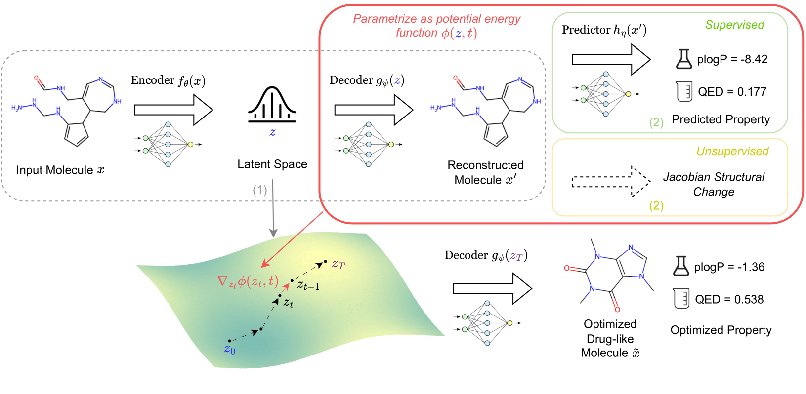
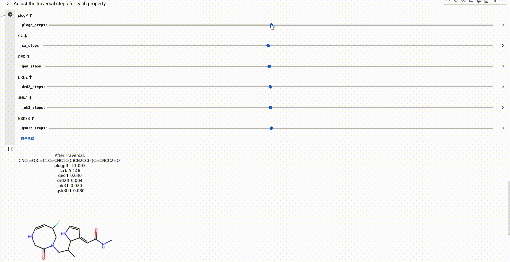

# ChemFlow: Navigating Chemical Space with Latent Flows

This repo implements the paper 🔗: [Navigating Chemical Space with Latent Flows](https://arxiv.org/abs/2405.03987) by
Guanghao Wei*, Yining Huang*, Chenru Duan, Yue Song, and Yuanqi Du.

Flows can uncover meaningful structures of latent spaces learned by generative models!
We propose a unifying framework to characterize latent structures by flows/diffusions for optimization and traversal.



## Live Demo

Try our live demo [here](https://colab.research.google.com/drive/1QAy_QoEnDRaiLF6kJ6RyhuGx1qCJXYKm?usp=sharing)!




## Quick Start

* Install all dependencies with `conda env create -f environment.yml`.
    * (Optional) Install [AutoDock-GPU](https://github.com/ccsb-scripps/AutoDock-GPU)      for docking binding affinity.
      See [Notes on Compiling AutoDock-GPU](#notes-on-compiling-autodock-gpu).
    * (Recommended) `mv .env.defaults .env` and specify `PROJECT_PATH` in `.env`. It is later used to run the
      experiments in the project root directory.
* [Download data](#download-data--model-checkpoints) and put it in the `data` directory.
* Train the VAE model by running `python experiments/train_vae.py`.
    * (Optional) Download our pre-trained VAE model checkpoint,
      see [Download Data & Model Checkpoints](#download-data--model-checkpoints).
* For supervised learning
    1. Prepare the data by running `python experiments/prepare_random_data.py`.
    2. Train the supervised surrogate predictor by running `bash experiments/supervised/train_prop_predictor.sh`.
    3. Train the energy network with supervised semantic guidance by
       running `bash experiments/supervised/train_wavepde_prop.sh`.
* For unsupervised learning
    1. Train the energy network with unsupervised diversity guidance by running `python experiments/train_wavepde.py`.
    2. Compute the pearson correlation coefficient by running `python experiments/unsupervised/corr.py`. Refer
       to [`notebooks/experiments/unsupervised/corr.ipynb`](notebooks/experiments/unsupervised/corr.ipynb) for more
       details.
    3. Modify [`experiments/utils/traversal_step.py`](experiments/utils/traversal_step.py) in place with the best
       correlation coefficient index.
* To reproduce the experiment results from the paper, run the following commands:
    * `bash experiments/optimization/optimization.sh` for similarity constrained optimization.
    * `bash experiments/optimization/uc_optim.sh` for unconstrained optimization.
    * `python experiments/optimization/optimization_multi.py` for multi-objective optimization.
    * `bash experiments/success_rate/success_rate.sh` for molecule manipulation tasks.

### Additional Arguments for the scripts

We used `lightning`([doc](https://lightning.ai/docs/pytorch/stable/cli/lightning_cli.html))
and `tap`([doc](https://github.com/swansonk14/typed-argument-parser)) to parse the arguments.
Usually, to pass in the arguments configured by `lightning`, some commands are like:

```bash
python experiments/supervised/train_prop_predictor.py \
    -e 50 \
    --model.optimizer sgd \
    --data.n 11000 \
    --data.batch_size 100 \
    --data.binding_affinity true \
    --data.prop 1err
```

## Download Data & Model Checkpoints

We extract 4,253,577 molecules from the three commonly used datasets for drug discovery
including [MOSES](https://github.com/molecularsets/moses), [ZINC250K](https://zinc.docking.org/)([download](https://www.kaggle.com/datasets/basu369victor/zinc250k/data)),
and [ChEMBL](https://www.ebi.ac.uk/chembl/).

* The processed dataset and VAE model checkpoints are available
  at [Google Drive](https://drive.google.com/drive/folders/1_FykJJNq0Qun7_e8-hlg2zvfkNkWJhe9?usp=sharing).
    * Data processing notebooks refers to [`notebooks/datasets.ipynb`](notebooks/datasets.ipynb).

## Notes on Compiling [AutoDock-GPU](https://github.com/ccsb-scripps/AutoDock-GPU)

The conda version of `AutoDock-GPU` is not compatible with RTX 3080 & 3090.
So don't use `environment.yml` to install `AutoDock-GPU`.
Make sure to follow this [issue](https://github.com/ccsb-scripps/AutoDock-GPU/issues/172#issuecomment-1010263229) to
compile the source code.
A good reference to the SM code
is [here](https://arnon.dk/matching-sm-architectures-arch-and-gencode-for-various-nvidia-cards/).

Some commands might be useful:

```bash
export GPU_INCLUDE_PATH=/usr/local/cuda/include
export GPU_LIBRARY_PATH=/usr/local/cuda/lib64

make DEVICE=CUDA NUMWI=128 TARGETS=86
```

To test if the compilation is successful, run the following command:

```bash
obabel -:"CCN(CCCCl)OC1=CC2=C(Cl)C1C3=C2CCCO3" -O demo.pdbqt -p 7.4 --partialcharge gasteiger --gen3d
autodock_gpu_128wi -M data/raw/1err/1err.maps.fld -L demo.pdbqt -s 0 -N demo
```

## Cite Us
```bibtex
@misc{wei2024navigating,
    title = {Navigating Chemical Space with Latent Flows},
    author = {Guanghao Wei and Yining Huang and Chenru Duan and Yue Song and Yuanqi Du},
    year = {2024},
    eprint = {2405.03987},
    archivePrefix = {arXiv},
    primaryClass = {cs.LG}
}
```